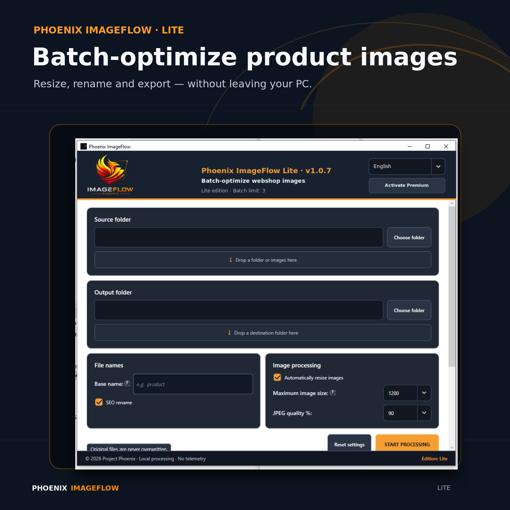

# Phoenix ImageFlow

  

Phoenix ImageFlow is a fast, privacy-friendly Windows application for batch resizing, renaming and optimizing JPG, JPEG and PNG images.

It is designed for online sellers, webshops, photographers and anyone who regularly needs to prepare multiple images.

[Download the latest release](../../releases/latest)

## Features

- Batch image resizing
- Sequential, SEO-friendly file renaming
- Maximum image-size and JPEG-quality controls
- Proportional resizing
- High-quality output
- Original files are never overwritten
- Portable and self-contained
- Interface available in 8 languages
- Fully offline
- No telemetry or automatic uploads

## Editions

### Lite

- Processes up to 3 images per batch
- Free for personal and commercial use
- No subscription

### Premium

- Removes the batch limit
- Uses the same application, activation only requires a license key
- One-time purchase, no subscription

[Get Phoenix ImageFlow Premium](https://payhip.com/b/Wexo0)

## System requirements

- Windows 10 or Windows 11
- 64-bit Windows
- No separate .NET installation required

## Installation

1. Open the [latest release](../../releases/latest).
2. Download `Phoenix_ImageFlow_1.0.7_Portable_win-x64.zip`.
3. Extract the ZIP file completely.
4. Start `Phoenix.ImageFlow.exe`.

## Privacy

Phoenix ImageFlow processes images locally on your computer. Images are not uploaded, and the application contains no telemetry.

## Links

- [Free Lite edition](https://payhip.com/b/OGJt3)
- [Premium license](https://payhip.com/b/Wexo0)
- [Phoenix Tools on Payhip](https://payhip.com/PhoenixTools)

## Related Phoenix tool

### Catch catalog mistakes before customers do

[Phoenix Catalog Proof](https://apify.com/phoenix-tools/phoenix-catalog-proof) compares approved and current ecommerce catalogs before migrations, feed uploads, marketplace syncs, campaigns or client handovers. It flags removed products, price and stock changes, duplicate identifiers, missing images, broken links and canonical mismatches, then creates HTML, CSV and JSON evidence reports.

- **Try it quickly:** copy the ready-made [baseline/current catalog demo](CATALOG_PROOF_DEMO.md).
- **Run the Actor:** [open Phoenix Catalog Proof on Apify](https://apify.com/phoenix-tools/phoenix-catalog-proof).
- **Pricing:** $0.05 per catalog comparison; Apify shows the exact charge before a run.

The Actor accepts CSV, JSON, XML, inline data, public feed URLs and Apify datasets. It is read-only, requires no store login or external API key, and keeps the full finding list in the run dataset.

## License

Phoenix ImageFlow is proprietary software. The Lite edition may be used free of charge for personal and commercial purposes. The source code is not distributed through this repository.
